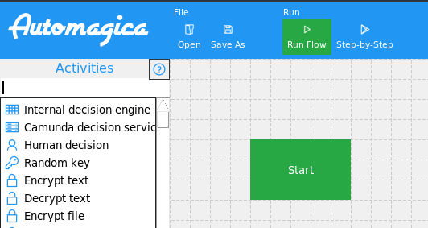

# Automagica Installation

Since Automagica was removed from the pip repository, some efforts are required to get Automagica running.

## Installation from Old Git Commit

Make sure `python3.8` and `python3-setuptools` are installed on your system.
Then run the following commands.

```bash
apt-get update -y
apt-get upgrade -y
apt-get install python3-setuptools -y
git clone https://github.com/automagica/automagica
cd automagica
git checkout d550012993104f71de6cce53fcc2f2b46900050a
pip install -e .
```

## Extending Automagica with Decision Capabilities

To adapt Automagica to work with the newly created decision tasks, replace the dist-package activities.py file of your Automagica installation with the patched one avaiable in this repository.

To do so, you need to replace a file.
Navigate to your Automagica folder:

Unix based OS:
`/usr/local/lib/python3.8/dist-packages/automagica/`

Windows:
`%LocalAppData%\Automagica\pkgs\automagica`

Replace your local `activitites.py` the extended version from this repository [`activities.py`](./activities.py).

After this, your Automagica software version can execute new decision tasks.

## Running

Automagica can be started by executing:

`automagica flow new`

When Automagica was extended correctly, three decision tasks (*Internal decision engine*, *Camunda decision service*, and *Human decision*) should be visible in the Automagica user interface like in this screenshot:



