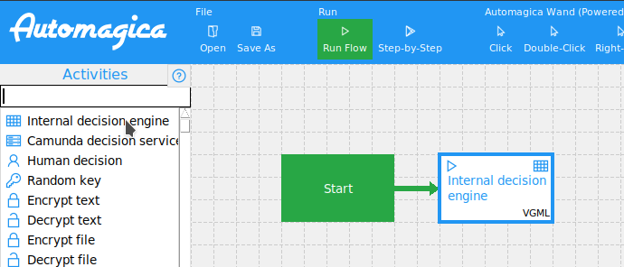

# Embedded Decision Engine for Automagica

This implementation of an embedded decision engine for Automagica internally uses the [pyDMNrules](https://github.com/russellmcdonell/pyDMNrules) library.

**Please make sure you have pyDMNrules installed and patched [(See instructions here)](./pyDMNrules/README.md)**.

## Setup

The library pyDMNrules reads decision tables from Excel worksheets (.xlsx).
An example worksheet can be found in the file [`tables/OrderReview.xlsx`](./tables/OrderReview.xlsx).

## Usage

To add a decision service, click on "Internal decision engine" in the Automagica modeler.

## Configuration

The embedded decision can be configured by clicking on the previously created task.

Configuration options:

| Name                 | Type            | Description                                             |
|----------------------|-----------------|---------------------------------------------------------|
| Path                 | String          | File path to the decision table (.xlsx Excel worksheet) |
| Variable names       | List of strings | Names of the input variables of the decision            |
| Variable values      | List of values  | Values of the corresponding variables of the decision   |
| Output variable name | String          | Output variable name of the decision table              |
| Return variable      | Variable        | Variable the decision result is written to              |

## Example

To get a running example, open [`automagica-embedded.json`](./automagica-embedded.json) with Automagica.

## Implementation

The source code of the embedded decision activity can be found in the file [`embedded_decision_activity.py`](./embedded_decision_activity.py).
