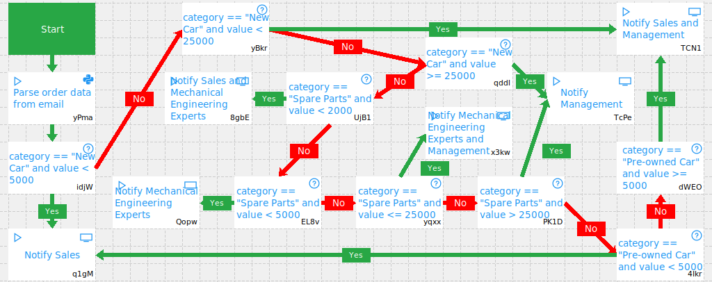

# Explicitly Modeled Decisions

Automagica is capable of representing decisions with *if / else* elements. No furthere setup or installation is required.

## Example

To get a running example, open [`automagica-explicitly.json`](./automagica-explicitly.json) with Automagica.

This results in an RPA process model like shown in the next image:

