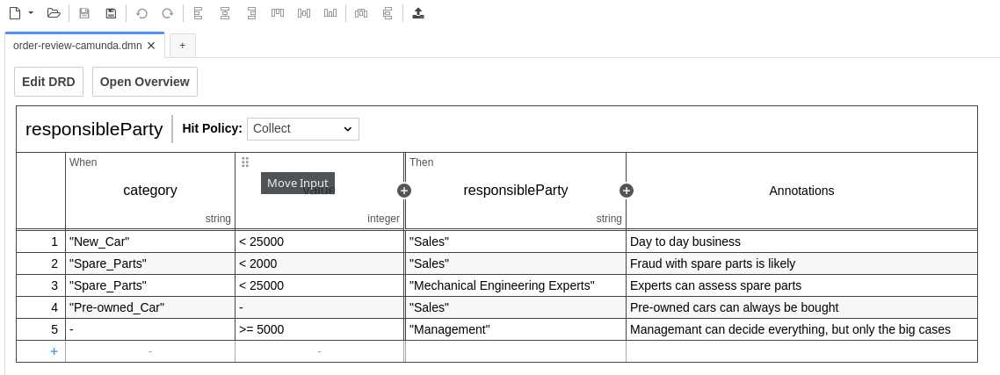
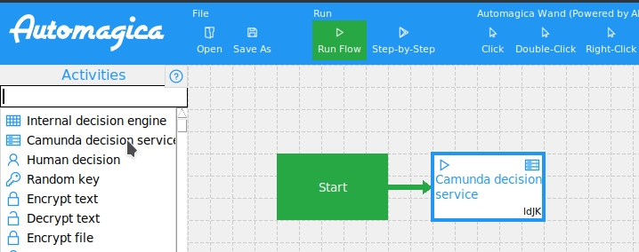
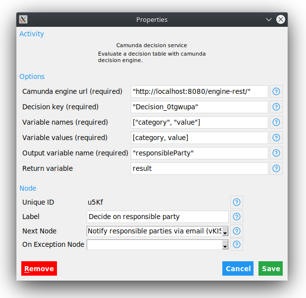

# External Decision Service for Automagica

## Setup

To enable external decision in Automagica, a decision service has to be configured.

### Install Camunda BPM Platform

Download and run the BPM platform following this instructions: [https://docs.camunda.org/get-started/quick-start/install/](https://docs.camunda.org/get-started/quick-start/install/).

For example with Docker:

```bash
docker pull camunda/camunda-bpm-platform:latest
docker run -d --name camunda -p 8080:8080 camunda/camunda-bpm-platform:latest
```

### Install Modeler

Download and install the Camunda Open Source Modeler for your operating system following the instructions on: [https://camunda.com/download/modeler/](https://camunda.com/download/modeler/).


### Deploy DMN model

1. Open `./order-review-camunda.dmn` with Camunda Modeler
2. Deploy model with the 'Deploy current diagram' button



## Usage

To add a decision service, click on "Camunda decision service" in the Automagica modeler.



## Configuration

The Camunda decision can be configured by clicking on the previously created task.



Configuration options:

| Name                 | Type            | Description                                           |
|----------------------|-----------------|-------------------------------------------------------|
| Camunda engine url   | String          | Message the user gets presented                       |
| Decision key         | String          | Decision options the user can choose from             |
| Variable names       | List of strings | Names of the input variables of the decision          |
| Variable values      | List of values  | Values of the corresponding variables of the decision |
| Output variable name | String          | Output variable name of the decision table            |
| Return variable      | Variable        | Variable the decision result is written to            |

## Example

To get a running example, open [`automagica-external.json`](./automagica-external.json) with Automagica.

## Implementation

The source code of the camunda decision activity can be found in the file [`camunda_decision_activity.py`](./camunda_decision_activity.py).
