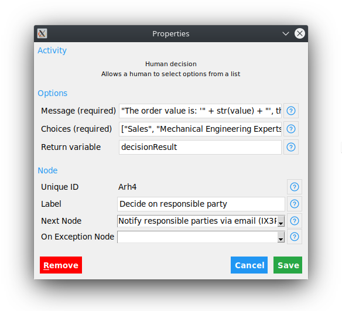

# Human Decisions for Automagica

## Setup

Make sure that [EasyGUI](http://easygui.sourceforge.net/) is installed on your system.

```bash
pip3 install easygui
```

## Usage

To add a human decision task, click on "Human decision" in the Automagica modeler.


## Configuration

The human decision can be configured by clicking on the previously created task.



Configuration options:

| Name            | Type            | Description                                |
|-----------------|-----------------|--------------------------------------------|
| Message         | String          | Message the user gets presented            |
| Choices         | List of strings | Decision options the user can choose from  |
| Return variable | Variable        | Variable the decision result is written to |

## Example

To get a running example, open [`automagica-human.json`](./automagica-human.json) with Automagica.

In this example, the human user will be promted to do a decision with the following dialog:


## Implementation

The source code of the human decision activity can be found in the file [`human_decision_activity.py`](./human_decision_activity.py).
